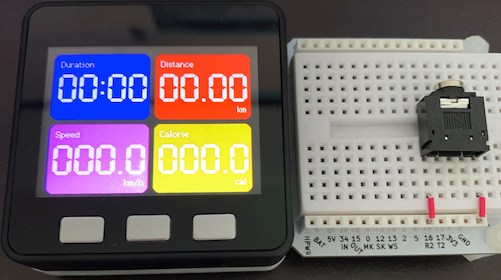
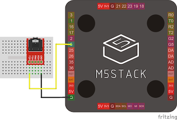

# M5Stack製エアロバイク用メーター

[](https://opensource.org/licenses/MIT)

M5Stackを使用して作成したエアロバイク用のメーターアプリです。



エアロバイクに備え付けられたメーターと同様に距離や消費カロリーを表示します。

## :warning: 注意事項

- このアプリは電気信号等を制御するため、使用機材に予期せぬ損害を与える可能性があります。
  もしも損害が発生した場合、エアロバイクの通常の使用方法とは異なるためメーカー保証の対象外となります。
- これらのリスクを十分にご理解頂いた上で、自己責任においてご利用ください。

## 使用機材

* [アルインコ コンフォートバイクⅡ](https://www.alinco.co.jp/product/fitness/detail/id=4175)
* [M5Stack Basic](https://www.switch-science.com/catalog/3647/)
* [SideBB for M5Stack(ブレッドボード)](https://www.switch-science.com/catalog/4098/)
* [3.5mm オーディオジャック](https://www.switch-science.com/catalog/619/)
* [ジャンパワイヤ](https://www.switch-science.com/catalog/314/)

## 作成手順

1. M5Stackのボトムを外し、代わりにSideBBを接続します
2. SideBBに回線図を参考ににオーディオジャック、ジャンパワイヤを設置します
3. Arudiono IDEなどを使用して、M5Stackに[IndoorBikeMonitor.ino](IndoorBikeMonitor.ino)をインストールします

    |  回路図 |
    | :-------------: |
    |   |
    | オーディオジャックの左右のピンとGND、5番を接続します  |

## 設置手順

1. エアロバイク備え付けのモニターに接続されているオーディオケーブルを外します
2. 外したケーブルを、作成したメーターのオーディオジャックに接続します

    |  オーディオケーブル位置 |
    | :-------------: |
    |   |

## 使用方法

エアロバイクを使用すると、作成したメーターに以下の情報が表示されます。

* ワークアウト時間(Duration)
* 走行距離(Distance)
* 時速(Speed)
* 消費カロリー(Calorie)

エアロバイクからは「車輪の回転」しか取得できないため、正確な値ではありません。

値を調整する場合は[IndoorBikeMonitor.ino](IndoorBikeMonitor.ino)の以下の値を変更してください。

```c
// ペダル1回転あたりの距離
const float perDistance = 0.006;
// ペダル1回転あたりのカロリー
const float perCalorie = 0.12;
```

## 作成者

Watanabe Toshinori – toshinori_watanabe@tiny.blue

## ライセンス

このプロジェクトはMITライセンスです。詳細は [ライセンス](LICENSE) ファイルを参照してください。

## 謝辞

このアプリを作成するにあたり、以下の記事・ライブラリを参照いたしました。

* [Aerocraft](https://github.com/mizucoffee/Aerocraft)
* [【フィットネスバイク】のインターネットを作る！！:Qiita](https://qiita.com/ie4/items/130308793444bd98179f)
